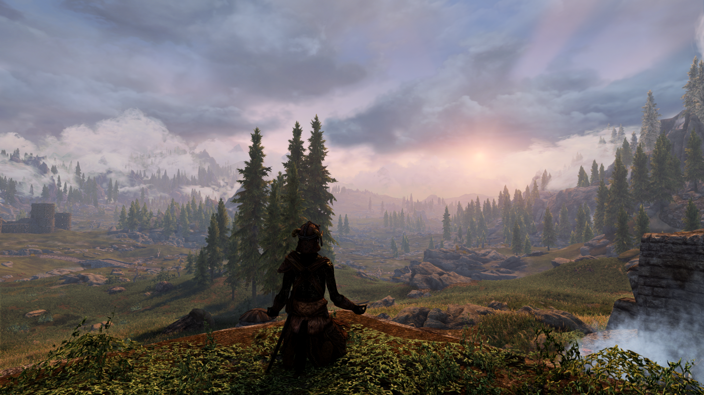

# Essentia
- [Preamble](#preamble)
- [Installation](#installation)
  - [Pre-Installation](#pre-installation)
    - [Installing Microsoft Visual C++ Redistributable Package](#installing-microsoft-visual-c-redistributable-package)
    - [Steam Config](#steam-config)
      - [Disable the Steam Overlay](#disable-the-steam-overlay)
    - [Change Steams Update Behavior](#change-steams-update-behavior)
    - [Set the Game language to English](#set-the-game-language-to-english)
    - [Clean Skyrim](#clean-skyrim)
    - [Start Skyrim](#start-skyrim)
  - [Using Wabbajack](#using-wabbajack)
    - [Preparations](#preparations)
    - [Downloading and Installing](#downloading-and-installing)
      - [Problems with Wabbajack](#problems-with-wabbajack)
  - [Post-Installation](#post-installation)
    - [Copy Game Folder Files](#copy-game-folder-files)
- [Updating](#updating)
- [Noteworthy Mods](#noteworthy-mods)
  - [Combat - Melee](#combat---melee)
  - [Combat - Magic](#combat---magic)
  - [Skills, Perks and More](#skills-perks-and-more)
  - [Quest and Encounter Mods](#quest-and-encounter-mods)
  - [Cities Towns and Villages](#cities-towns-and-villages)
  - [NPC Retextures](#npc-retextures)
  - [Followers](#followers)
  - [Audio and Weather](#audio-and-weather)
- [In-Game MCM Options](#in-game-mcm-options)
- [Character Creation](#character-creation)
- [FAQ](#faq)
- [Tweaking Performance](#tweaking-performance)
  - [Tweaking the ENB](#tweaking-the-enb)
  - [Tweaking the Game Settings](#tweaking-the-game-settings)
- [Removing the Modlist](#removing-the-modlist)
- [Credits and Thanks](#credits-and-thanks)
- [Contact](#contact)
- [Changelog](#changelog)

# Notes for Testers: [Plzread](https://github.com/SudoDoubleDog/Essentia/blob/master/notesfortesters.md)

# Preamble

Essentia is a modlist that I feel is the "soul" of what Skyrim Special Edition should have been, with enhanced mechanics, roleplaying utilities, graphics, quests, dialogue, and NPC's, all while remaining as simple to pick up and play as possible.

This modlist primarily revolves around [Morrowind Miscellania](https://www.nexusmods.com/skyrimspecialedition/mods/3259), Simon Magus' mods, and [Legacy of the Dragonbon](https://www.nexusmods.com/skyrimspecialedition/mods/11802).

Combat is handled by [Blade and Blunt](https://www.nexusmods.com/skyrimspecialedition/mods/34549), [Arena](https://www.nexusmods.com/skyrimspecialedition/mods/33487), and a custom [Experience](https://www.nexusmods.com/skyrimspecialedition/mods/17751) patch that rewards you for combat.

## Installation

### Pre-Installation

These steps are only needed if you install this Modlist for the first time. If you update the Modlist, jump straight to [Updating](#updating).

#### Installing Microsoft Visual C++ Redistributable Package

I doubt you need to do this since you likely already have this installed. The package is required for MO2 and you can download it from [Microsoft](https://support.microsoft.com/en-us/help/2977003/the-latest-supported-visual-c-downloads). Download the x64 version under "Visual Studio 2015, 2017 and 2019". [Direct link](https://aka.ms/vs/16/release/vc_redist.x64.exe) if you can't find it.

#### Steam Config

##### Disable the Steam Overlay

The Steam Overlay can cause issues with ENB and is recommended to be turned off.

Open the Properties window (right click the game in your Library->Properties), navigate to the _General_ tab and un-tick the _Enable the Steam Overlay while in-game_ checkbox.

#### Change Steams Update Behavior

SSE is still being updated by Bethesda (they only add Creation Club content). Whenever the game updates, the entire modding community goes silent for the next one or two weeks because some mods need to be updated to the latest game runtime version.

To ensure that Steam does not automatically updates the game for you, head over to the Properties window, navigate to the _Updates_ tab and change _Automatic updates_ to _Only update this game when I launch it_. You should also disable the Steam Cloud while you're at it.

#### Set the Game language to English

This entire Modlist is in English and 99% of all mods you will find are also in English. I highly recommend playing the game in English and **I will not give support to people with a non-English game**.

Open the Steam Properties window, navigate to the _Language_ tab and select _English_ from the dropdown menu.

#### Clean Skyrim

I highly recommend uninstalling the game through Steam, deleting the game folder and reinstalling it. You should also clean up the `Skyrim Special Edition` folder in `Documents/My Games/`.

#### Start Skyrim

After you have done everything above and got a clean SSE installation ready, start the Launcher and open the _Options_ menu.

1. Click on _High_
2. Set the _Aspect Ratio_ and _Resolution_ to your monitor's native values
3. Set _Antialiasing_ to _Off_
4. Check _Windowed Mode_ and _Borderless_

Start the game and exit once you're in the main menu.

### Using Wabbajack

#### Preparations

Grab the latest release of Essentia from [the release tab](https://github.com/SudoDoubleDog/Essentia/releases).

Download the release to a _working folder_. This folder **must not** be in a _common folders_ like your Desktop, Downloads or Program Files folder. It's best to create a Wabbajack folder near the root level of your drive like `C:/Wabbajack`.

Grab the latest release of Wabbajack from [here](https://github.com/wabbajack-tools/wabbajack/releases) and place the `Wabbajack.exe` file in the _working folder_.

#### Downloading and Installing

The download and installation process can take a very long time depending on your system specs. Wabbajack will calculate the amount of threads it will use at the start of the installation. To have the highest amount of threads and thus the fastest speed, it is advised to have the working folder on an SSD. This modlist requires that you have at least **140 GB** of free space to install successfully.

1. Open Wabbajack
2. Load the Modlist from Disk
3. Adjust the download and installation paths
4. Click the Go/Begin button
5. Wait for Wabbajack to finish

##### Problems with Wabbajack

There are a lot of different scenarios where Wabbajack will produce an error. I recommend re-running Wabbajack before posting anything. Wabbajack will continue where it left off so you lose no progress.

**Could not download x**:

If a mod updated and the old files got deleted, it is impossible to download them. In this case just wait until I update the Modlist.

**x is not a whitelisted download**:

This can happen when I update the modlist. Check if a new update is available and wait if there is none.

**Wabbajack could not find my game folder**:

Wabbajack will not work with a pirated version of the game. If you own the game on Steam, go back to the [Pre-Installation](#pre-installation) step.

### Post-Installation

#### Copy Game Folder Files

Download the latest ENB Series from [here](http://enbdev.com/download_mod_tesskyrimse.htm). Open the archive with 7zip, open the Wrapper Version folder, and copy `d3d11.dll` and `d3dcompiler_46e.dll` to your game folder.

Copy the all of the files from the `MO2/Game Folder Files` directory into your game folder.

## Updating

If this Modlist receives an update please check the Changelog before doing anything. Always backup your saves or start a new game after updating.

**Wabbajack will delete all files that are not part of the Modlist when updating!**

This means that any additional mods you have installed on top of the Modlist will be deleted. Your downloads folder will not be touched!

Updating is like installing. You only have to make sure that you select the same path and tick the _overwrite existing Modlist_ button.

## Noteworthy Mods

### Combat - Melee

[Blade and Blunt](https://www.nexusmods.com/skyrimspecialedition/mods/34549) is a streamlined combat overhaul designed to enhance Skyrim’s difficulty and encourage active resource management. Unlike other combat overhauls, it does not seek to import mechanics from other games into Skyrim. Instead, it enhances the existing mechanics of Skyrim’s combat and focuses on tightening the gameplay, to allow for more player skill and RPG-like character development.

[Arena](https://www.nexusmods.com/skyrimspecialedition/mods/33487) is a difficulty overhaul designed to enhance Skyrim’s original Encounter Zones rather than replace them. It is designed to further the sense of progression in the game, by tiering dungeons according to enemy type. This encourages the players to make judgments about the difficulty of an encounter based on experience and intuition, rather than consulting a complex chart on a mod page. This approach allows Arena to provide players with a more robust sense of progression, while retaining the freedom and independence of an open world game.

### Combat - Magic

[Apocalypse](https://www.nexusmods.com/skyrimspecialedition/mods/1090), [Mysticism](https://www.nexusmods.com/skyrimspecialedition/mods/27839)

### Skills, Perks and More

[Trua](https://www.nexusmods.com/skyrimspecialedition/mods/32549), a simple mod that makes shrines more immersive and adds aspects of religious worship. No longer can you just accept any random blessing from any shrine. Using a shrine now presents you with a choice to worship the deity or not. If you do, you kneel in reverence and receive the deity's blessing and the Pray power, allowing you to pray to them anywhere.

[Adamant](https://www.nexusmods.com/skyrimspecialedition/mods/30191) is a streamlined perk overhaul designed to enhance every aspect of your Skyrim experience. It thoroughly overhauls the game’s eighteen skill trees in order to provide the player with compelling choices and smooth progression from start to finish. While Adamant does increase the total number of perks in the game, it avoids bloat, sprawl, and power creep by balancing its selection of perks around Vanilla perk gains. Like many modern perk overhauls, it provides support for popular gameplay styles that are underutilized in the Vanilla game, such as shouts, staves, and unarmed combat.

[Skyrim Uncapper - Adamant Arena](https://www.nexusmods.com/skyrimspecialedition/mods/35366) Uncapper Preset. Balanced progression across builds, freedom to pursue noncombat skills, dynamic 1-50 advancement experience. Perk rate expects Adamant. Engaging high-level growth. 

Werewolves are overhauled by [Growl](https://www.nexusmods.com/skyrimspecialedition/mods/31245), [Sacrosanct](https://www.nexusmods.com/skyrimspecialedition/mods/3928) for vampires.

[Aetherious](https://www.nexusmods.com/skyrimspecialedition/mods/26686) is a streamlined race overhaul designed to make races more meaningful without making them more restrictive.

[Mundus](https://www.nexusmods.com/skyrimspecialedition/mods/33411) is a streamlined Standing Stone overhaul designed to ensure that every stone fills a niche and offers competitive bonuses to different playstyles.

### Quest and Encounter Mods

Essentia comes with a wide variety of new quest and encounters. A few are listed below.

[Hammet's Dungeons](https://www.nexusmods.com/skyrimspecialedition/mods/12186) add high quality dungeons.

[Missives](https://www.nexusmods.com/skyrimspecialedition/mods/17576?tab=files) adds a laEssentia number of localized radiant quests found at Missive Boards of varying difficulty and with varying rewards. Missives has been extended to Solstheim.

[The Wheels of Lull](https://www.nexusmods.com/skyrimspecialedition/mods/748) is an enormous, sprawling expansion sized quest mod that serves not just only as a sequel to Sotha Sil Expanded, but ties together almost all my previous Skyrim quest mods, including Aethernautics, Mzark, and even Brhuce Hammar.  In it, the player is recruited into the ranks of a rejected Chronographer platoon, and shunted off to the Clockwork City outpost of Lull-Mor, a precariously perched outpost at the edge of Sotha Sil's domain. Much like Sotha Sil Expanded, the mod gives a focus on puzzle and problem solving. Featuring five enormous dungeons, with mini-bosses, unique treasures, and plenty of puzzles, you'll have your work cut out for you. The player will find themselves exploring strange new landscapes, from the deepest oceans, to underground forests, to giant foundries, and going up against strange new monsters, while wielding several new weapons, from the Harquebuses of Chronographers, to the great Unwinder of Goveri. They will find themselves dressing themselves in Chronographer robes. WoL also serves as introduction to the stranger side of TES lore, diving into the strange and ridiculous world of TES metaphysics, and will teach players about the Towers, Landfall, and the eponymous Wheels of Lull.

[The Tale of Tsatampra Xiros](https://www.nexusmods.com/skyrimspecialedition/mods/36707) Battle your way through the fragmented memories of Hermaeus Mora's rogue acolyte - Tsatampra Xiros. The pages of his chronicle are populated with distorted visions of himself, his fellow acolytes, and the terrifying creatures he consorted with. And somewhere, nestled in the heart of the Tale, Xiros himself awaits you...

[Krovaxis](https://www.nexusmods.com/skyrimspecialedition/mods/34750) The weak and the winnowed tremble! Molag Bal has visited a host of new powers upon his temple. Long dormant beneath the ice, these functions of Krovaxis once again present themselves to a worthy steward...

[Legacy of the Dragonborn](https://www.nexusmods.com/skyrimspecialedition/mods/11802) is one of the most acclaimed expansion sized mods for Skyrim which offers without equal; the most versatile, most expansive and most extensive display space for artifacts the Elder Scrolls series has ever seen! On top of offering a Museum for display of nearly 3500 potential unique items and sets (including supported mods), this mod offers an entirely new guild faction you start from the ground up, “The Explorer’s Society”. It offers dozens of new quest, a handful of major quest arcs and numerous useful and unique mechanics all centered around your home at the Dragonborn Gallery in Solitude.

### Cities Towns and Villages

Jk's Skyrim, Dawn of Skyrim, Expanded Towns and Cities, ETaC Jk's Skyrim replacer

### NPC Retextures

Simple yet effective, Total Character Makeover with additional textures for beast races, and True Faces of Skyrim. This is a plugin-less setup, and it still looks fantastic.

### Followers

[Inigo](https://www.nexusmods.com/skyrimspecialedition/mods/1461) is a fully voiced khajiit adventuring companion with over 7000 lines of unique dialogue - much of it about you. He'll level alongside you and avoid most traps. If you're sneaking he won't chatter and he'll whisper if you talk to him. He can run out of arrows. He's highly skilled in archery, one-handed, and sneak.

[Lucien](https://www.nexusmods.com/skyrimspecialedition/mods/20035) is a fully voiced Imperial follower with around 3000 lines of immersive, lore-friendly dialogue. Though he arrives in Skyrim as a cowardly scholar, he'll gradually gain strength and confidence by your side until he grows into a hero in his own right.

### Audio and Weather

We're using Cathedral Weathers, True Storms, and a few addons for Cathedral to replace some of its weathers with Obsidian variants. The ENB included with the install is [Silent Horizons](https://www.nexusmods.com/skyrimspecialedition/mods/21543), that I have customized to my taste and performance needs, as well as many extra custom LUTs included.

## In-Game MCM Options

Everything not listed below is already configured for you. Feel free to peruse the settings and change them as you like.

**Wait until no new messages appear in the top left corner!**

After starting a new game, you will spawn in the LAL cell. You’ll find a key to the shelves on a table, with basic loadout necessities. Wait until the text in the top left is finished loading all of your mods, then press Esc and go to your MCM settings.

If it's not listed below then either the defaults are good enough or it's up to user preference. Work through all of the menus mentioned below while additionally customizing anything else as you see fit.

### A Matter of Time

- Presets :
  - Load user settings

### Follower Framework

- System → Save/Load Configuration :
  - Load from File : Click
  
### Lanterns of Skyrim
- Disable Lanterns in villages
  
### LOTD Settings

- LOTD Settings → General → Shippment Crate Locations :
  - Carriages : Enabled
  - Inns : Enabled
  - Player Houses : Enabled
  
### Quick Light

- Quick Light → Brightness :
  - Brightness - Bright

### SkyUI

- General → Item List :
  - Font Size : User Preference
- Advanced → SWF Version Checking :
  - Map Menu : Disabled
  - Favorites Menu : Disabled
  - Inventory Menu : Disabled
  - Barter Menu : Disabled
  - Container Menu : Disabled
  - Crafting Menu : Disabled

### VioLens

- Profile System → Menu Settings :
  - Load : Essentia

## Character Creation

Using [RaceMenu](https://www.nexusmods.com/skyrimspecialedition/mods/19080) you can create a stunning looking character. I have included A LOT of new eyes. Have fun!

## FAQ

- You have Nemesis, why not use CGO? 
   - Because I don't want to.

- Will you help me if I add [X] mod?
   - No. The only mods that I will give assistance adding are widescreen fixes. If you want to build on this list, feel free, but do not ask how to do so in my support channel. Use general-se-discussion.

## Tweaking Performance

My Setup:

- Ryzen 2700x
- 2080 Super
- 32GB DDR4-3200 RAM (CL 14)
- Game and MO2 running on an M.2 NVME SSD

### Tweaking the ENB

This should always be the first thing you tweak. Disabling the ENB entirely can give you anything from 20 to >70 FPS. The ENB this Modlist comes with (see [Audio and Weather](#audio-and-weather)) is rather performance intensive. Open the ENB GUI using `Right Shift + Enter` (`Right Shift` is under the `Enter` key). This will open up the ENB GUI where you can enable and disable certain effects in the left panel.

- `Bloom`: Can give you up to 3 FPS, will make light sources less bright
- `DepthOfField`: Can give you up to 10 FPS, disabled by default and not really suited for gameplay
- `Ambient Occlusion`: This one is a big hitter. You can get up to 20 FPS by disabling this but the effect is very noticeable
- `Distant/DetailedShadow`: Those two can really give you a lot of FPS back depending on your shader settings (game settings). They are very noticeable.
- `ComplexFire/ParticleLights`: You won't see a lot of difference at first when disabling those two, but when particles are on screen (eg using magic or near light sources such as fires), they can _burn_ through your FPS

### Tweaking the Game Settings

I highly recommend using [BethINI](https://www.nexusmods.com/skyrimspecialedition/mods/4875) which is included in this Modlist (can be found in `MO2/tools/BethINI`). I recommend tweaking the `Detail` section for more FPS:

- `Shadow Resolution`: Very big one. A good balance is `2048` which is the borderline between high FPS drainage and garbage looking shadows.
- `Ambient Occlusion`: Highly recommended to leave this at `None`. The ENB this Modlist comes with, uses the ENB SAO which is 10x better and performance friendly than base game SAO.
- `Detailed Draw Distance`: Maybe try `2000` instead of `2800` but you won't notice a lot of FPS gain (maybe 1-3)
- `Remove Shadows`: If you really struggle, use this. This will disable all Shadows (not recommended)

## Removing the Modlist

You can just remove the MO2 folder and be done with it. SKSE and ENB files will still be in your game folder so I recommend using [ENB and ReShade Manager](https://www.nexusmods.com/skyrimspecialedition/mods/4143) if you want to remove the ENB.

## Credits and Thanks

- _YOU_ for actually reading the readme. Thanks a ton!!
- erri120, iXanza, and jdsmith2816 - README format
- Halgari and everyone the WJ Team - Wabbajack is awesome and so are you
- Frenchy - Thanks for the great work on the Linkle preset!
- Johanlh for keeping the base visuals of NOISE in his NOIR modlist. 
- My friends here at Wabbajack, for being the best friends I've ever had.

## Contact

While I'm always available on the [Wabbajack Discord](https://discord.gg/wabbajack), I would advise checking the [Issues](https://github.com/SudoDoubleDog/Essentia/issues) (open **and** closed ones) on GitHub first if you have any problems. The same goes for _Enhancements_ or _Feature/Mod Requests_. **DO NOT DM ME ON DISCORD. I WILL NOT PROVIDE SUPPORT FOR YOU IN DMS**.

## Changelog

See [Changelog](CHANGELOG.md).
